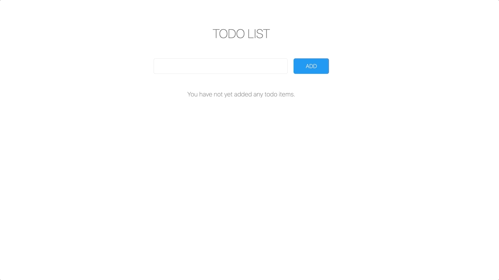

# JavaScript Todo List Project

> Project #2 of [The Modern JavaScript Masterclass](https://github.com/codingcourses/modern-javascript-masterclass).

In this project, we will be learning about using `localStorage` and third-party front-end frameworks
to save time designing UI elements. [UIkit](https://getuikit.com/) will be the one used for
subsequent projects. In addition, we will continue to practice with DOM manipulation and the
model-view-controller (MVC) design pattern.

## Learning Goals

These are specific topics covered in this project:

- `localStorage`
- [UIkit](https://getuikit.com/) front-end framework
- MVC design pattern
